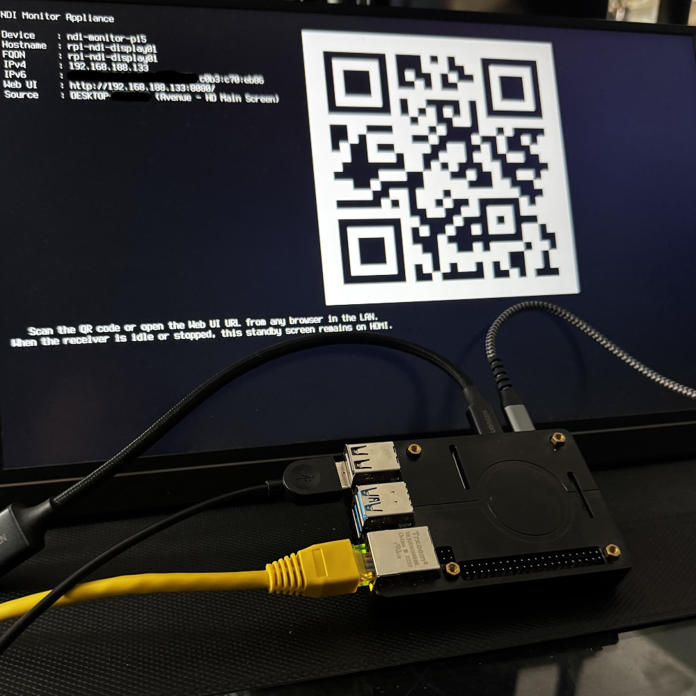
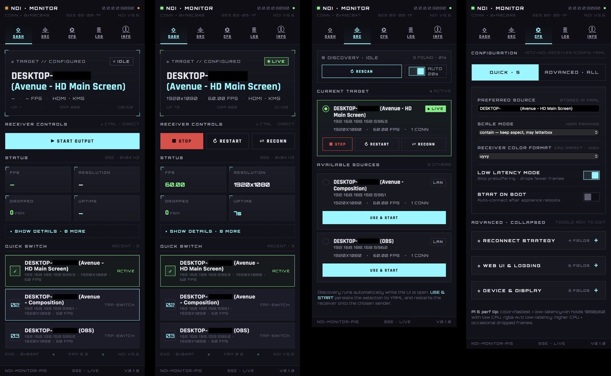
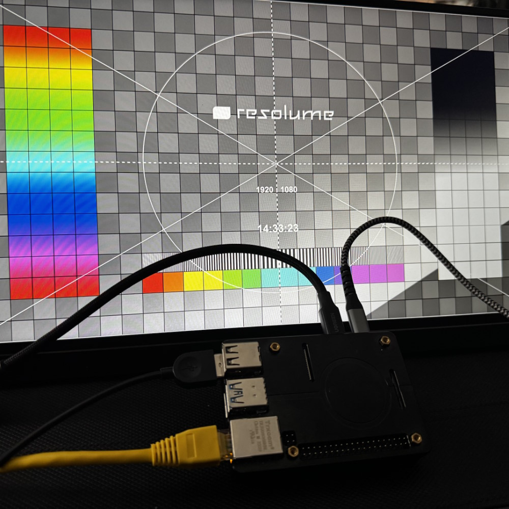

# NDI Monitor for Raspberry Pi

Turn a Raspberry Pi 4 or 5 into a standalone NDI receiver. Plug in an HDMI display, power it on, scan the QR code that appears on screen, and you're controlling it from your phone. No keyboard, no mouse, no setup wizard.

The Pi boots headless, renders one NDI source fullscreen over KMS/DRM, and serves a browser UI for everything else: source discovery, switching, settings, and logs.

> **NDI SDK required.** The SDK is not included — download it separately from [ndi.tv](https://ndi.tv/sdk/). See [NDI SDK](#ndi-sdk) below.

**1.** Boot → standby on HDMI with hostname, IP and QR code



**2.** Scan QR → drive the appliance from your phone (Dashboard, Sources, Settings)



**3.** Pick a source → it plays fullscreen over HDMI



---

## Why this exists

Dedicated NDI receivers are expensive. A Raspberry Pi is cheap by comparison — still well below many off-the-shelf professional boxes — fits in your hand, and runs 24/7 at low power. This turns it into a zero-config appliance:

- Boot → standby screen appears on HDMI with URL and QR code
- Scan QR → Web UI opens on your phone
- Pick a source → video plays fullscreen
- Done

No display manager, no desktop, no X11. Just NDI in, HDMI out.

---

## What you get

- **Mobile-first Web UI** — React SPA, V2-Console look, 5 tabs (Dashboard, Sources, Settings, Logs, About) — usable from phone or desktop
- **QR code on boot** — scan once to get the URL, never type an IP again
- **Auto-discovery** — backend re-scans NDI every 20s while the UI is open; quick-switch the last seen senders straight from the dashboard
- **Auto-save settings** — toggles and selects persist immediately, text fields on blur; if the receiver is running, settings changes trigger a controlled restart automatically
- **REST API** — automate everything with `curl` or any HTTP client
- **Live status + logs over SSE** — status, discovery, and log entries stream to the browser in real time with auto-reconnect
- **Auto-start + reconnect** — configure it once, it recovers on its own
- **Performance controls** — pixel format, FPS cap, low-latency mode, bandwidth mode
- **Selectable HDMI output resolution** — pick a real output mode (e.g. drive a 4K display at `1920×1080@60`) from the Web UI; a true DRM modeset, with automatic fallback to native if the mode isn't available
- **Headless HDMI** — KMS/DRM, no desktop environment required

---

## Quick Start

```bash
# Install system dependencies
sudo apt-get update
sudo apt-get install -y \
  git rsync curl ca-certificates build-essential cmake pkg-config \
  libsdl2-dev libasound2-dev ripgrep avahi-daemon qrencode

# Clone and install
git clone https://github.com/Huftierchen/rPi-ndi-monitor.git /home/pi/ndi-monitor
cd /home/pi/ndi-monitor

export NDI_SDK_DIR=/opt/ndi_sdk   # path to your NDI SDK install
sudo ./install.sh
sudo reboot
```

After reboot:

1. HDMI shows the standby screen — URL, hostname, IP, QR code
2. Scan the QR or open `http://<pi-ip>:8080/` in a browser
3. Go to **Sources**, run discovery, pick a source
4. Enable **Auto-start** in **Settings** if the Pi should reconnect after each boot

Full deployment guide: [docs/DEPLOYMENT_PI5.md](docs/DEPLOYMENT_PI5.md)

---

## Updating

```bash
cd /home/pi/ndi-monitor
sudo ./update.sh
```

`update.sh` pulls the latest code (`git pull --ff-only` as the repo owner), stops `ndi-web`, rebuilds web and native receiver, and restarts both `ndi-standby` and `ndi-web`. Set `SKIP_GIT_PULL=1` to update from already-checked-out code.

---

## Web UI

| Page | What it does |
|---|---|
| `/` | Dashboard — receiver state, start / stop / restart / reconnect |
| `/sources` | Discover NDI senders on the LAN, select and switch source |
| `/settings` | Persistent config — source, reconnect, performance, display |
| `/logs` | Live web and receiver logs, downloadable |
| `/about` | Appliance info and runtime paths |

---

## Performance

Pi 5 handles 1080p60 comfortably. On Pi 4, these settings give the best results:

| Setting | Recommended value |
|---|---|
| `colorFormat` | `fastest` or `uyvy` |
| `lowLatencyMode` | `true` |
| `audioEnabled` | `false` if audio not needed |
| Sender resolution | `1080p30` where possible |

**Pi 4 measured at 1080p60:**

| Config | CPU | Dropped frames |
|---|---|---|
| `rgba`, no low-latency | ~168% | 226 |
| `fastest` + low-latency | ~121% | 2 |

---

## HDMI output resolution

By default the receiver uses the display's native resolution and scales the NDI frame to fit. You can force a specific HDMI output mode — handy to drive a 4K-capable display at 1080p and cut GPU load.

1. In **Settings**, open **HDMI OUTPUT RESOLUTION** (available in both quick and advanced views).
2. The dropdown lists the modes the connected display actually advertises — the list appears after the receiver has run at least once (start it once with `Auto` first).
3. Pick a mode (e.g. `1920×1080 · 60 Hz`). Saving restarts the receiver and applies the mode via a real DRM modeset.

The Dashboard's **Output** stat shows the resolution/refresh actually being driven. If a configured mode is unavailable (e.g. a different monitor was attached), the receiver falls back to the native mode, flags it in the UI, and keeps running — the appliance never goes dark. The mode list is re-detected on every receiver start.

Config field: `display.outputMode` — `auto` or `<W>x<H>@<Hz>` (e.g. `1920x1080@60`). See [docs/OPERATIONS.md](docs/OPERATIONS.md#hdmi-output-resolution).

---

## NDI SDK

The NDI SDK is not included in this repository (license does not permit redistribution).

Download the Linux SDK tarball from [ndi.tv/sdk](https://ndi.tv/sdk/) and extract it to `/opt/ndi_sdk`. The build expects:

- `include/Processing.NDI.Lib.h`
- `lib/aarch64-rpi4-linux-gnueabi/libndi.so*`

`install.sh` copies the required runtime libraries to `/opt/ndi-monitor/lib` during deployment.

---

## REST API

```
GET  /healthz
GET  /api/status
GET  /api/version
GET  /api/settings
PUT  /api/settings
GET  /api/discovery
POST /api/discovery
POST /api/control/start
POST /api/control/stop
POST /api/control/restart
POST /api/control/reconnect
POST /api/control/switch-source
GET  /api/logs?scope=web|receiver&limit=100
GET  /api/logs/download?scope=web|receiver
GET  /api/events
```

**Switch source:**
```bash
curl -X POST http://pi-host:8080/api/control/switch-source \
  -H 'content-type: application/json' \
  -d '{"sourceName":"DESKTOP-DS7KLEC (TouchDesigner)"}'
```

**Configure and enable auto-start:**
```bash
curl -X PUT http://pi-host:8080/api/settings \
  -H 'content-type: application/json' \
  -d '{
    "receiver": {
      "sourceName": "My NDI Source",
      "colorFormat": "fastest",
      "lowLatencyMode": true,
      "autoStart": true,
      "reconnect": { "enabled": true }
    }
  }'
```

---

## Local Build

**Prerequisites:** Node.js 22+, Corepack, CMake 3.16+, `g++`, `libsdl2-dev`, `libasound2-dev`

The repo is a pnpm workspace with two web packages:

- `apps/web` — Fastify backend (REST, SSE, receiver supervision)
- `apps/web-ui` — React + Vite SPA (built into `apps/web-ui/dist/`, served by `apps/web`)

```bash
# Install + build both apps (frontend then backend)
corepack prepare pnpm@10.7.1 --activate
corepack pnpm install
corepack pnpm build

# Backend tests
corepack pnpm --filter @ndi-monitor/web test

# Frontend dev server (Vite, proxies /api → 127.0.0.1:8080)
corepack pnpm dev:ui

# Backend dev server (tsx watch)
corepack pnpm dev:server

# Receiver (real SDK)
cmake -S apps/receiver -B apps/receiver/build \
  -DNDI_SDK_DIR=/opt/ndi_sdk \
  -DRECEIVER_ALLOW_STUB_BACKEND=OFF
cmake --build apps/receiver/build -j"$(nproc)"

# Receiver (stub — no SDK needed)
cmake -S apps/receiver -B apps/receiver/build -DRECEIVER_ALLOW_STUB_BACKEND=ON
cmake --build apps/receiver/build -j"$(nproc)"
```

---

## Architecture

- **`ndi-web.service`** — Fastify + TypeScript backend: REST API, SSE, config, logs, receiver supervision, and serves the prebuilt SPA from `apps/web-ui/dist/` (with SPA fallback for client-side routes)
- **`apps/web-ui`** — React 18 + Vite SPA: 5 mobile-first screens, talks to the backend only via REST + SSE
- **`apps/receiver`** — C++17: NDI receive, reconnect, HDMI rendering via SDL2/KMS/DRM
- The web service manages the native receiver as a child process — no second systemd service for the receiver
- A `DiscoverySupervisor` in the backend runs NDI discovery every 20s while at least one SSE client is connected, then idles when nobody is watching. Each scan is merged with a 60-second TTL so senders survive single mDNS misses.
- Discovery itself runs as a short-lived subprocess to avoid holding an NDI handle while idle
- The standby screen (`ndi-standby.service`) draws directly to `tty1` at boot and after stop

More detail: [docs/ARCHITECTURE.md](docs/ARCHITECTURE.md)

---

## Runtime Paths

| What | Where |
|---|---|
| Config | `/etc/ndi-receiver/config.yaml` |
| Status snapshot | `/var/lib/ndi-receiver/receiver-status.json` |
| Web log | `/var/log/ndi-receiver/web.log` |
| Receiver log | `/var/log/ndi-receiver/receiver.log` |
| Install root | `/opt/ndi-monitor` |

---

## Troubleshooting

**No NDI sources appear**
- Check that `avahi-daemon` is running
- Verify the sender is on the same LAN segment

**HDMI shows no video after receiver starts**
```bash
curl http://127.0.0.1:8080/api/status
# Look for: connectionState: connected, videoActive: true
```
Also check `/dev/dri/*` device handles and `tail -f /var/log/ndi-receiver/receiver.log`.

**Login prompt reappears on HDMI**
```bash
sudo systemctl status getty@tty1.service ndi-standby.service
# getty@tty1 should be inactive, ndi-standby should be active (exited)
```

Operations reference: [docs/OPERATIONS.md](docs/OPERATIONS.md)

---

## Known Limitations

- HDMI audio needs final validation with real signal and display hardware
- SDL2/KMS/DRM behavior can vary by display, cable, adapter, and firmware
- No authentication — designed for trusted LAN use only
